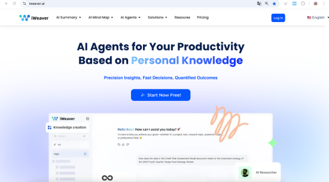
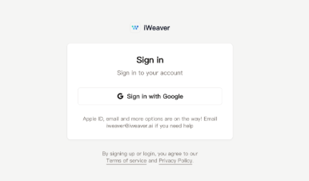
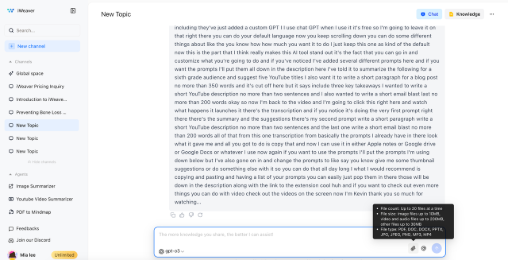
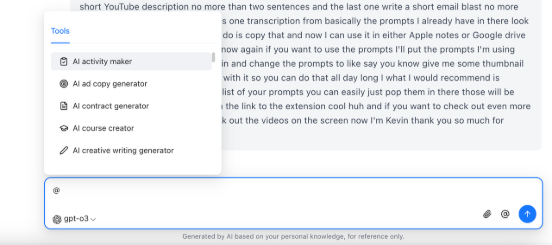
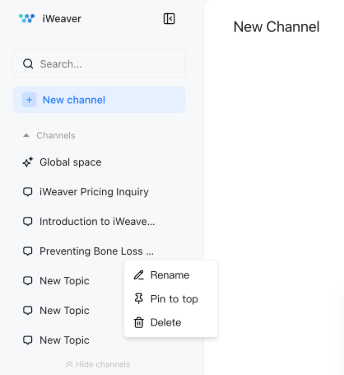
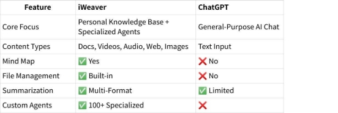


**Summary-iweaver**

**iWeaver: Your AI-Powered Knowledge Companion**

**iWeaver is an AI-driven productivity platform powered by intelligent AI Agents for your productivity, based on personal knowledge.** It helps individuals—whether researchers, students, content creators, or business professionals—manage, organize, and apply information more effectively. iWeaver transforms scattered content into structured, actionable knowledge, all within a single intuitive workspace.

1. **What Makes iWeaver Different**

iWeaver isn’t just another productivity tool—it’s a smart, personal workspace powered by your own knowledge. With over **100 specialized AI Agents**, iWeaver helps you **streamline tasks, automate workflows, and work smarter**, all while understanding your unique context. It’s designed for individuals who need more than generic AI responses—whether you’re analyzing research, summarizing content, or managing complex ideas, iWeaver adapts to the way *you* think and work.

2. **Core Capabilities**

1. **Multi-Format Content Processing**

   iWeaver supports a wide range of input formats, allowing you to build your knowledge base from diverse sources, including:

- **Documents**: PDF, Word, PowerPoint
- **Web Content**: Online articles, blog posts, and public URLs
- **Videos**: YouTube, Dailymotion, TED Talks (via link)
- **Audio**: Recordings from lectures, meetings, or podcasts
- **Images**: Screenshots, handwritten notes, diagrams, and infographics

  This versatility ensures that no matter where your knowledge lives, iWeaver can help you capture, understand, and apply it effectively.

  From there, iWeaver’s AI capabilities help you make sense of your content:

- **AI Summarization**: Instantly extract key takeaways from long documents, videos, and more—without having to read or watch everything.
- **Mind Map Generation**: Convert complex content into editable mind maps to visualize structure, concepts, and connections at a glance.
- **AI Q&A and Chat**: Ask questions about any file or topic in your workspace and receive accurate, context-aware answers grounded in your own materials.
- **Knowledge Organization**: Build a searchable, taggable, and categorized knowledge base organized by topic, project, or workflow.
- **Content Creation Assistance**: Turn accumulated insights into high-quality outputs—emails, scripts, articles, and more—all tailored to your context.
- **Workflow Automation**: Delegate repetitive research and analysis tasks to AI Agents, so you can focus on strategic thinking and creative work.

  3. **Meet the Agents: Specialized AI Assistants**

  iWeaver is powered by 100+ AI Agents—each designed to tackle specific tasks with precision. Here are some of the most impactful:

1. **Image Summarizer**
- Extracts and summarizes text from images, including charts, handwritten notes, and whiteboards.
- Provides quick visual data interpretation—perfect for students, researchers, and professionals working with visual materials.
2. **YouTube Summarizer**
- Transcribes, summarizes, and timestamps video content.
- Supports Q&A about the video and can even process entire playlists for fast knowledge extraction.
3. **Mind Map Generator**
- Instantly transforms documents, links, or transcripts into editable mind maps.
- Helps you visualize complex ideas, structure projects, and enhance deep learning.
4. **AI Analysis Agents**\
   ` `Delivers tailored insights across a variety of domains, including:
- Market trends and competitor analysis
- Business model evaluation
- Survey and feedback interpretation
- Financial news and report breakdowns
- Legal document summaries
- Content performance analytics

  4. **How iWeaver Works: A Quick Start Guide**

  **Step 1: Sign Up & Log In**

- Open your browser and go to: [**https://www.iweaver.ai**](https://www.iweaver.ai/)** Or search **“iWeaver AI”** on Google and click the official site.
- On the homepage, click the **“Log In”** button in the top-right corner.

  

- In the pop-up window, select **“Sign in with Google”**

  

- Choose the Google account you'd like to use (or enter your email and password manually).
- Once you're signed in, you'll be taken to the iWeaver dashboard where you can begin using the features.

  **Step 2: Upload Your Content**

- Use the 📎 attachment icon to upload up to 20 files at a time
- Supported formats include PDF, DOCX, MP4, MP3, JPG, PNG, etc.

  

  **Step 3: Choose an Agent**

- Just mention an Agent in the chat, or choose one from the top Agents listed in the left sidebar.

**Step 4: Review and Interact**

- The AI processes your content instantly
- You can ask follow-up questions, generate mind maps, or extract key ideas

  **Step 5: Save & Organize**

- All outputs are automatically stored in your private knowledge base
- Use “Topics” (custom folders) to group and manage files

  5. **Creating and Managing Your Knowledge Base**

1. **How are documents saved and organized?**\
   ` `All uploaded files are automatically saved to your **personal knowledge base**. Only you can access these files, ensuring privacy and data security.

   Click the **“Knowledge”** button in the upper-right corner to view your saved files. Use **Topics** to organize your files into separate collections.

   

2. **What are Topics and how do they work?**\
   ` `Topics are customizable folders designed to group documents around specific projects or workflows.

   To create one:

1. Click **“New Channel”** in the left sidebar.
2. Name your topic and start adding content.
3. You can rename the topic or add notes at any time.\
   ` `This helps you stay organized and focused on your goals.

   

   6. **iWeaver Ecosystem**

- **Browser-based + Extensions**: Access via web or extension into your workflow
- **Conversational UI**: Natural chat-based interactions
- **Multilingual Support**: English, Chinese, Spanish, French, Japanese, Korean & more
- **Security First**: Private, encrypted, and optionally deployable on-premise

  7. **iWeaver vs ChatGPT** 

  

  **Summary:**

- **iWeaver** is your all-in-one knowledge management assistant.
- **ChatGPT** is great for open-ended conversations and general tasks.

  8. **Support & Community**

- **Discord**: [Join here](https://discord.com/invite/y3Y4Zc6NNQ)
- **YouTube**: [Watch tutorials](https://www.youtube.com/@iWeaverAI)
- **Email**: <iweaver@iweaver.ai>

